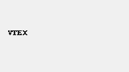
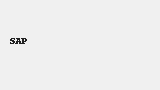
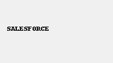
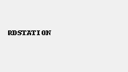

  

# Bem-vindo à Documentação N4LINK

A plataforma **N4LINK** é um iPaaS (Integration Platform as a Service) que conecta sistemas legados e modernos de forma ágil, segura e escalável.

---

## 🌐 Sistemas já integrados

  

    
     <small>VTEX</small>
  

  

    
     <small>SAP</small>
  

  

    
     <small>TOTVS</small>
  

  

    
     <small>SALESFORCE</small>
  

  

    
     <small>RDSTATION</small>
  

  

    
     <small>PAGSEGURO</small>
  

> Os demais logos serão adicionados em breve.
